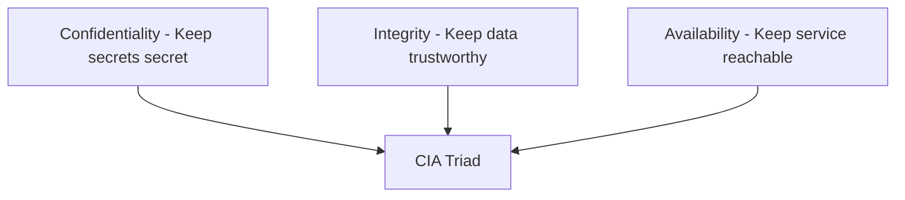

# Cybersecurity Architecture Series — CIA Triad Wiki

This wiki explains the **CIA triad** in cybersecurity:

- **Confidentiality**
- **Integrity**
- **Availability**

The goal is to make the concepts easy to understand, review, and apply when designing or evaluating an IT system.

---

## How to use this wiki

1. Start with [[Home](https://github.com/alishahbaz/Cybersecurity-Architecture-Series/wiki/)].
2. Read [[CIA-Triad](https://github.com/alishahbaz/Cybersecurity-Architecture-Series/wiki/CIA-Triad)] for the big picture.
3. Study each pillar:
   - [[Confidentiality](https://github.com/alishahbaz/Cybersecurity-Architecture-Series/wiki/Confidentiality)]
   - [[Integrity](https://github.com/alishahbaz/Cybersecurity-Architecture-Series/wiki/Integrity)]
   - [[Availability](https://github.com/alishahbaz/Cybersecurity-Architecture-Series/wiki/Availability)]
4. Use [[Checklist](https://github.com/alishahbaz/Cybersecurity-Architecture-Series/wiki/Checklist)] when reviewing an IT project.

---

## Core model

---

## What the CIA triad means

### Confidentiality

Confidentiality means that only authorized people or systems can access sensitive information.

Example:

- A customer’s balance should only be visible to that customer.
- An administrator’s password hash should not be readable by ordinary users.

Main controls:

- Authentication
- Authorization
- Access control
- Encryption

See [[Confidentiality](https://github.com/alishahbaz/Cybersecurity-Architecture-Series/wiki/Confidentiality)] for details.

---

### Integrity

Integrity means that data and logs are trustworthy and can be detected if tampered with.

Example:

- A log file should not be silently deleted or edited by an attacker.
- A blockchain transaction should not be secretly changed after being recorded.

Main controls:

- Logging
- Hashing
- Digital signatures
- Message authentication codes
- Immutable ledgers

See [[Integrity](https://github.com/alishahbaz/Cybersecurity-Architecture-Series/wiki/Integrity)] for details.

---

### Availability

Availability means that authorized users can access the system when they need it.

Example:

- A bank website should remain reachable for real customers.
- A service should not crash because of malicious flooding.

Main threats:

- Denial of service
- Distributed denial of service
- SYN flood
- Reflection and amplification attacks

See [[Availability](https://github.com/alishahbaz/Cybersecurity-Architecture-Series/wiki/Availability)] for details.

---

## Page map

- [[Home]]
- [[CIA-Triad]]
- [[Confidentiality]]
- [[Integrity]]
- [[Availability]]
- [[Checklist]]

---

## Quick review question

If you are reviewing a project, ask:

1. Is sensitive data protected from unauthorized people?
2. Can tampering be detected?
3. Is the system available when needed?

If the answer to all three is **yes**, you have covered the CIA triad.

Back to [[Home]].
